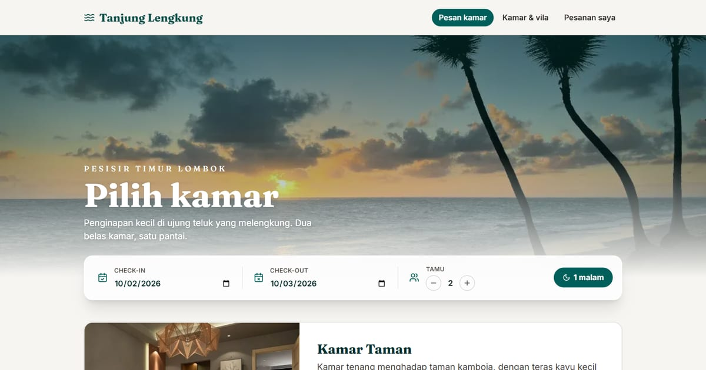

# Tanjung Lengkung — Pesan kamar di ujung teluk

Penginapan kecil (fiktif) di pesisir timur Lombok. Paradigma **rentang tanggal**: check-in/check-out, ketersediaan dihitung per malam, tarif malam biasa dan akhir pekan.

**Demo live:** https://reservasi-hotel-kappa.vercel.app



> Purwarupa desain. Nama usaha, data, dan harga fiktif. Tidak ada pembayaran dan tidak ada yang dikirim ke server: pemesanan disimpan di `localStorage` peramban. Tanggal dan jam dihitung dalam WIB di peramban; keterisian contoh dibuat stabil per tanggal.

## Fitur

- Sisa unit = malam paling penuh dalam rentang menginap; alasan ditampilkan bila kamar tidak bisa dipesan.
- Malam Jumat dan Sabtu memakai tarif akhir pekan; rincian per jenis malam plus pajak & layanan 21%.
- `/kamar` dan `/kamar/[id]` — foto, fasilitas, kebijakan; tombol pesan membawa `?kamar=`.
- `/pesanan` — pesanan saya, hitung mundur, batas batal gratis 3 hari.

## Halaman

`/` · `/kamar` · `/kamar/[id]` · `/pesanan`

## Teknologi

- Next.js 15.5 (App Router) dan React 19
- Tailwind CSS v4
- JavaScript
- Framer Motion, Lucide (ikon)
- Font: Fraunces, Inter (next/font)
- SEO: metadata per halaman, Open Graph, sitemap.xml, dan robots.txt

## Kredit foto

Semua foto berlisensi CC0 (domain publik), dikonversi ke WebP.

| Berkas | Fotografer | Sumber | Lisensi |
| --- | --- | --- | --- |
| `kamar-hangat.webp` | — | [rawpixel](https://www.rawpixel.com/image/5917601/image-public-domain-wood-house) | CC0 |
| `kamar-kota.webp` | — | [rawpixel](https://www.rawpixel.com/image/5920688/photo-image-public-domain-house-home) | CC0 |
| `pantai-senja.webp` | Joe deSousa | [StockSnap](https://stocksnap.io/photo/tropical-beach-I6WYGD7TNZ) | CC0 |
| `ruang-teras-kayu.webp` | Joshua Ness | [StockSnap](https://stocksnap.io/photo/house-home-CLD6T4J9VZ) | CC0 |
| `teras-kolam.webp` | Matt Bango | [StockSnap](https://stocksnap.io/photo/modern-house-UIU7D31EDY) | CC0 |
| `teras-tropis.webp` | World Travel Adventures | [StockSnap](https://stocksnap.io/photo/furniture-patio-KOIAWLY3SU) | CC0 |
| `villa-modern.webp` | — | [rawpixel](https://www.rawpixel.com/image/5907779/photo-image-public-domain-free-cc0) | CC0 |

## Menjalankan secara lokal

```bash
npm install
npm run dev
```

Buka http://localhost:3000. Untuk build produksi: `npm run build` lalu `npm start`.

---

Bagian dari koleksi 5 aplikasi reservasi di [PortalReservasi](https://portal-reservasi-nu.vercel.app). Dibuat oleh [PintuWeb](https://pintuweb.com), jasa pembuatan website.
